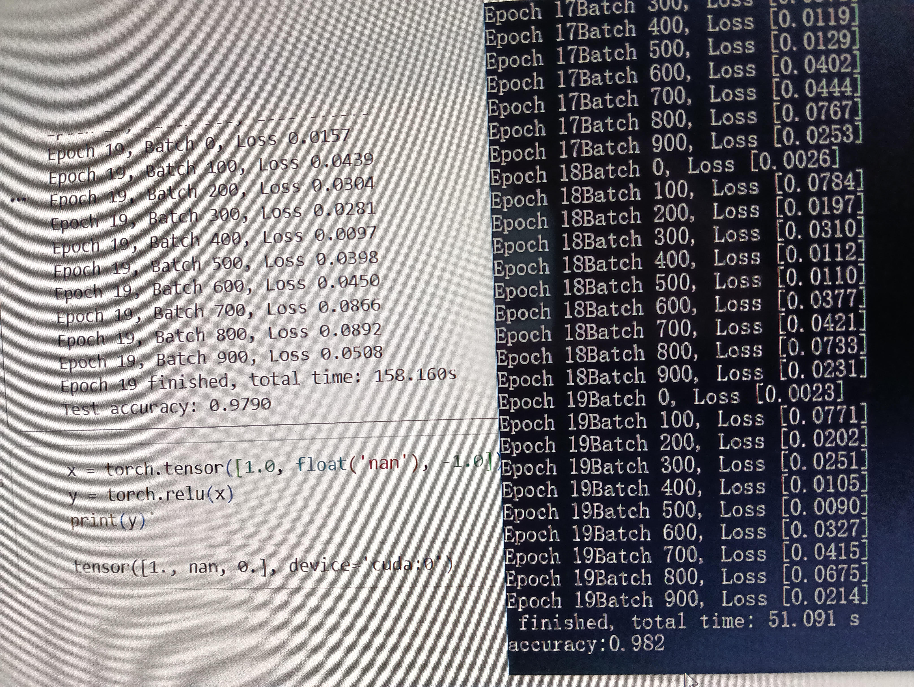

# Zeta 🚀


**Zeta** is a deep learning framework created by *WiltChamberlain*, designed to help users understand how deep learning works while providing a lightweight and extensible platform for C++ developers.

Most open-source deep learning libraries are either Python-based 🐍 or extremely large 📦, making it difficult for developers to grasp their internal workings. Moreover, extending these frameworks with low-level features can be challenging in Python. **Zeta** aims to solve these issues by offering a framework that is both readable 📖 and easy to extend 🛠️.

We want **Zeta** to be accessible to everyone 🌎, including users without any AI background. In the future, we plan to add more features, including but not limited to Transformer models 🔄, distributed architectures 🌐, and more.

Another focus of the project is reinforcement learning 🎮 and game AI 🤖. **Zeta** can serve as a platform for experimenting with reinforcement learning ideas, especially in games, making research and experimentation both educational 📚 and fun 🎉.

We hope more people could come to maintain this library, make it the best c++ deep learning framework in the world if possible.

---

# Features ✨

Currently, **Zeta** supports:

- CPU-based neural networks with forward and backward propagation 🖥️  
- GPU neural networks (CuNN) using custom CUDA kernels ⚡  
- GPU neural networks (DNN) leveraging cuDNN and cuBLAS 🧠  
- A DAG system for automatic differentiation in backward 🔗
- Linear layer, fully connected layer 🖥️
- Convolution layer 🔗
- Maxpooling 🧠 
- Relu, Sigmoid, Tanh, ...  ✏️  
- Monte Carlo Tree Search (MCTS) simulation system 🎲  
- An alpha-beta pruning algorithm for tic-tac ⚡ 
- MNIST dataset examples ✏️  
- Tic-Tac-Toe ❌⭕ and small-board Go 🏯 implementations for testing framework capabilities

---

# Achievements 🏆

On the MNIST dataset (60,000 samples), **Zeta** achieves:

- **3x faster training speed than PyTorch** ⚡  
- Comparable accuracy to PyTorch ✅  
- **Unbeatable Tic-Tac-Toe AI player** 👑

This demonstrates that **Zeta** is not only lightweight and extensible but also highly efficient for practical machine learning tasks 💡.



# Demo
In the test folder, there are some demos for using it, here is an example:
```
void test_dnn_linear() {

    //Create a neural network using cuda cudnn library 
    DNN network;
    //Set the learning rate, this can optimized to a single class optimizer in the future
    network.SetLearningRate(0.1);

    //create a linear layer (make sure to you CreateDnnLayer instead of CreateLayer if you are using DNN network, input dim :2 ,outut dim :2
    DnnLinear* layer1 = network.CreateDnnLayer<DnnLinear>(2, 2);
    //set the weights and bias
    layer1->weights(0, 0) = 0.1f;
    layer1->weights(0, 1) = 0.2f;
    layer1->weights(1, 0) = 0.3f;
    layer1->weights(1, 1) = 0.4f;
    layer1->b(0) = 0.5f;
    layer1->b(1) = 0.6f;
    //create a sigmoid layer
    auto act = network.CreateDnnLayer<DnnAct>(LayerType::Act_Sigmoid);

    //create another linear layer  input dim :2 ,outut dim :1
    DnnLinear* layer2 = network.CreateDnnLayer<DnnLinear>(2, 1);
    layer2->weights(0, 0) = 0.7f;
    layer2->weights(0, 1) = 0.8f;
    layer2->b(0) = 0.9f;

    //create a mse loss layer.
    CuMseLayer* mse = network.CreateLayer<CuMseLayer>();
    //set the label value for mse 
    mse->label = Tensor(1);
    mse->label(0) = 1.0;

    //make sure you create a outputlayer as the last layer, otherwise it may cause runtime issue
    OutputLayer* output = network.CreateLayer<OutputLayer>();

    //connect the layers with intuitive grammaer 
    layer1->AddLayer(act)->AddLayer(layer2)->AddLayer(mse)->AddLayer(output);

    //input tensors : batchSize * Dim .
    Tensor xs(1, 2);
    xs(0, 0) = -100.0;
    xs(0, 1) = 2.0;

    //make sure to alloc gpu memory before running forward and backward
    network.AllocDeviceMemory();

    //training loop, two iterations
    network.Forward(xs);
    network.Backward();
    network.Step();
    network.Forward(xs);
    network.Backward();
    network.Step();

    //fetch result to cpu, these interface can be optimized, often used for printing result
    mse->FetchPredYToCpu();
    mse->PrintPredY();


    //fetch grad to cpu and print the result, api could be optimized.
    network.FetchGrad();
    network.PrintGrad();


    


    //fetch the updated paramters of the neural network to cpu side
    network.FetchResultToCpu();
    //print the paramters (weights and bias of each layer)
    network.Print();

}
```


# Change Log 📜

## [v0.1.0] - Initial Release 🚀
- Initial release of **Zeta** deep learning framework   


## [v0.1.1] - Add Gomoku ⚡
- **Gomoku** is added, and fix some cloning bugs.
- Support training but it is very slow.
- add if constexpr to simplify code modifying

## [v0.2] - Add Q Learning Algorithm 
- Use Q learning to achieve perfect AI for Gomoku (3*3) (TicTacToe) and Sliding Tic-Tac-Toe in about 4 seconds.
- No neural network used.

## [v0.2.1] - Add C interface
- Add a C interface and dll export, successfully used in another project. Added simple Hex logic.